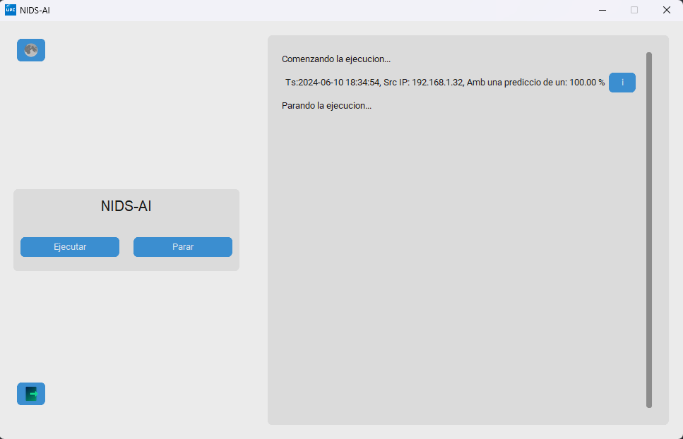

### NIDS-AI

---

#### Descripción
NIDS-AI es un programa en Python diseñado para análisis continuo y masivo de posibles intrusiones utilizando herramientas como Zeek, Filebeat, Elasticsearch y Kibana, integradas bajo un entorno Docker. Este sistema aprovecha un modelo preentrenado de machine learning para mejorar la detección de amenazas en redes.

---

#### Instalación

1. **Clonar el repositorio:**
   ```bash
   git clone <URL_DEL_REPOSITORIO>
   cd NIDS-AI
   ```

2. **Instalar dependencias:**
   Para instalar las dependencias necesarias, ejecuta uno de los siguientes comandos:
   - Utilizando `pip` directamente:
     ```bash
     pip install -r requirements.txt
     ```
   - Ejecutando el script Python que maneja la instalación de requisitos:
     ```bash
     python install_requirements.py
     ```

---

#### Uso

1. **Ejemplo de uso:**

   Para ejecutar NIDS-AI, sigue estos pasos:
   ```bash
   docker-compose up -d   # Iniciar contenedores Docker necesarios
   python3 /app/main.py   # Iniciar el análisis de intrusiones
   ```

2. **Descripción del flujo:**

   La aplicación también cuenta con una interfaz visual que incluye dos botones principales: Ejecutar y Parar.
   
   Cuando se ejecuta la aplicación utilizando el botón correspondiente, NIDS-AI comienza a capturar datos de la herramienta Zeek y los envía al modelo de IA para su análisis. Si el modelo detecta una amenaza, la aplicación muestra una línea indicando la naturaleza de la amenaza detectada en tiempo real dentro de la misma interfaz gráfica.

---



#### Contribución

- Si deseas contribuir al desarrollo de NIDS-AI, por favor sigue estos pasos:
  1. Haz un fork del repositorio.
  2. Crea una rama con una nueva funcionalidad (`git checkout -b feature/nueva-funcionalidad`).
  3. Realiza tus cambios y haz commit de ellos (`git commit -am 'Añadida nueva funcionalidad'`).
  4. Haz push a la rama (`git push origin feature/nueva-funcionalidad`).
  5. Crea un pull request en GitHub.

---

#### Licencia

Este proyecto está licenciado bajo la [Licencia MIT](LICENSE).

---

#### Contacto

Para cualquier consulta, sugerencia o problema relacionado con NIDS-AI, por favor contacta a [Fran Martin] <franmartinaguilar@gmail.com>.