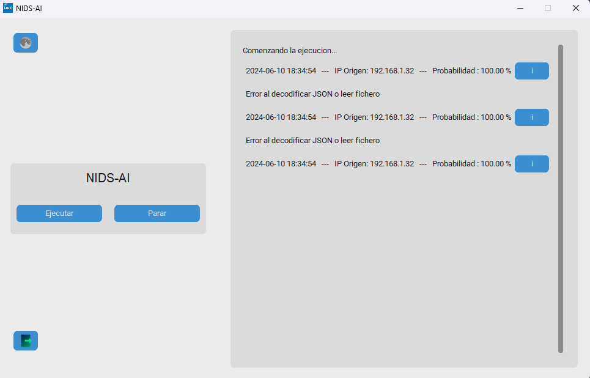
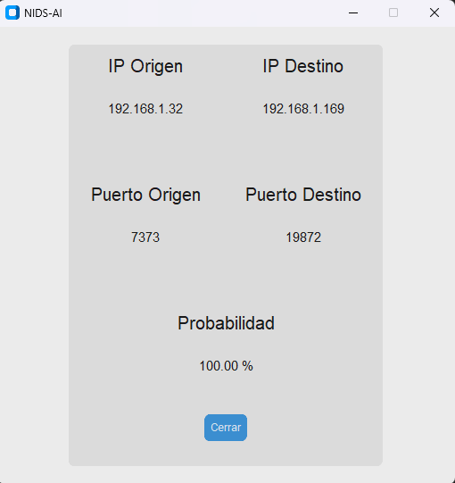

# NIDS-AI

This repository contains a machine learning project focused on detecting intrusions on a local network. The project utilizes machine learning techniques to identify potential intrusions. Below is an overview of the repository contents and instructions for use.

## Repository Contents

- **`Tkinter App`**: Visual application utilizing the machine learning model.
- **`Docker Service`**: Integrates Zeek and Elastic Stack.
- **`notebook.ipynb`**: Jupyter Notebook with the project's code and analysis located in the "preproceso" directory.
- **`Documentation`**: Project documentation in Spanish.
- **`Paper`**: Project paper in Spanish.

## Project Description

NIDS-AI is a Python-based program designed for continuous and large-scale analysis of potential intrusions. It leverages tools such as Zeek, Filebeat, Elasticsearch, and Kibana, all integrated within a Docker environment. The system utilizes a pre-trained machine learning model to enhance network threat detection.

## Notebook Contents

The Jupyter Notebook (`preproceso/notebook.ipynb`) includes:

1. **Project Introduction**: Overview and objectives of the project.
2. **Data Source Description**: Information on the data source used.
3. **Data Preprocessing**: Details on data cleaning and transformation techniques.
4. **Visualizations**:
   - Fraudulent vs. Legitimate Transactions
   - Box and Whisker Plots
   - Heatmaps
   - Temporal Plots
5. **Model Evaluation Criteria**: Methods for assessing model performance.
6. **Machine Learning Methods**:
   - Naive Bayes (NB)
   - Decision Tree (DT)
   - Random Forest (RF)
   - XGBoost (XGB)
   - LightGBM (LGBM)
   - CatBoost (CB)
   - Neural Networks (ANN)
7. **Comparison and Conclusions**: Comparative analysis of methods and final conclusions.
8. **Model Saving and Loading**: Code for saving and loading the best model.
9. **Unit Testing**: Unit tests for the selected model.

## Instructions to Run the Notebook

1. **Clone the Repository**:

   ```bash
   git clone https://github.com/Franmartin09/IA-Credit-Card
   cd IA-Credit-Card
   ```

2. **Install Dependencies**:

   Ensure Python and Jupyter Notebook are installed. Then, install the required dependencies:

   ```bash
   pip install -r requirements.txt
   ```

3. **Open the Notebook**:

   Launch Jupyter Notebook and open `notebook.ipynb`:

   ```bash
   jupyter notebook notebook.ipynb
   ```

4. **Run the Cells**:

   Execute the cells in the notebook to perform the analysis and visualize the results.

## Instructions to Execute the App

1. **Clone the Repository**:

   ```bash
   git clone https://github.com/Franmartin09/NIDS-AI.git
   cd NIDS-AI
   ```

2. **Install Dependencies**:

   To install the necessary dependencies, run one of the following commands:
   - Using `pip` directly:
     ```bash
     pip install -r requirements.txt
     ```
   - Running the Python script for installation:
     ```bash
     python install_requirements.py
     ```

3. **Run the Application**:

   To start NIDS-AI, follow these steps:
   ```bash
   docker-compose up -d   # Start the required Docker containers
   python3 /app/main.py   # Begin intrusion analysis
   ```

4. **Application Flow**:

   The application features a graphical interface with two main buttons: Run and Stop.
   
   When the application is run using the appropriate button, NIDS-AI begins capturing data from the Zeek tool and sends it to the AI model for analysis. If the model detects a threat, the application displays a line indicating the nature of the threat in real-time within the same graphical interface.



<p align="center">
  
</p>

## Documentation

- **[Paper in Spanish](https://github.com/Franmartin09/NIDS-AI/blob/main/Paper%20-%20NIDS%20AI.pdf)**
- **[Documentation in Spanish](https://github.com/Franmartin09/NIDS-AI/blob/main/Documentation%20-%20NIDS%20AI.pdf)**

The documentation provides extensive details about the project, the methods used, and the results obtained.

## Contribution

- To contribute to the development of NIDS-AI, please follow these steps:
  1. Fork the repository.
  2. Create a new branch for your feature (`git checkout -b feature/new-feature`).
  3. Make your changes and commit them (`git commit -am 'Add new feature'`).
  4. Push to your branch (`git push origin feature/new-feature`).
  5. Create a pull request on GitHub.

## License

This project is licensed under the [MIT License](https://github.com/Franmartin09/NIDS-AI/blob/main/LICENSE).

## Contact

For any questions, suggestions, or issues related to NIDS-AI, please contact via email: [Fran Martin](mailto:franmartinaguilar@gmail.com).

---
